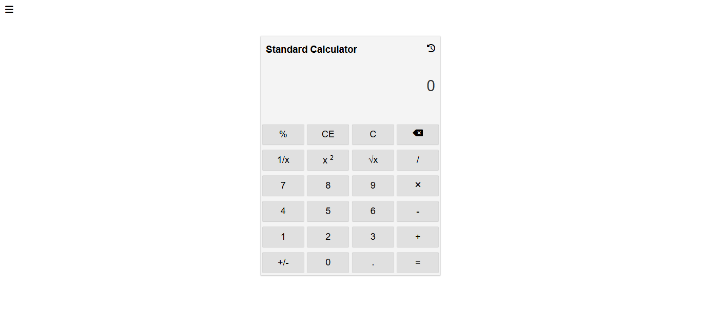
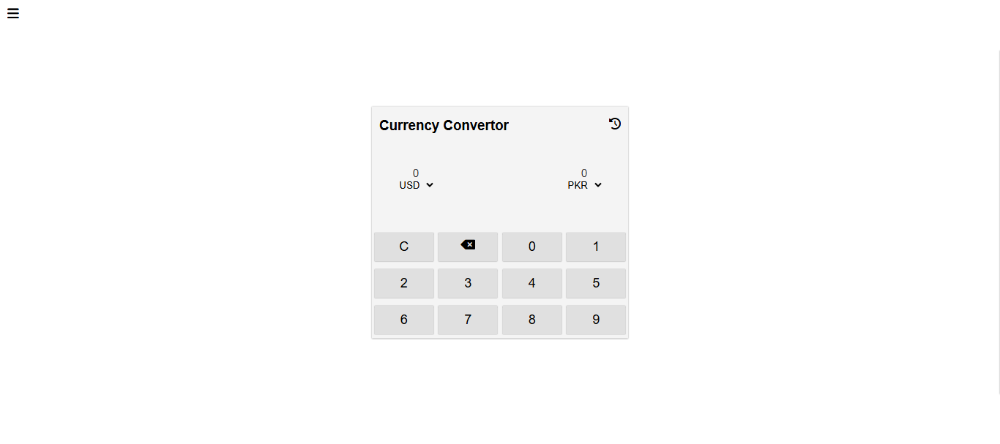
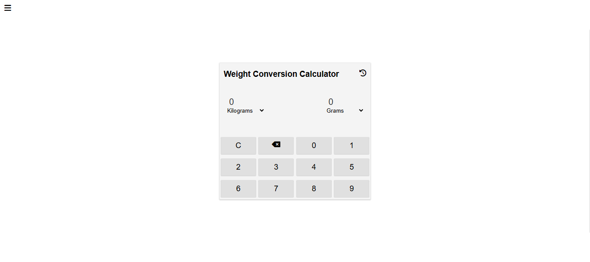

<p align="center">
  
</p>

# All-in-One Calculator

A simple web app that combines:
- 🧮 Standard Calculator  
- ⚖️ Weight Converter  
- 💱 Currency Converter  

---


---

## 📑 Table of Contents
- [Tech Stack](#-tech-stack)
- [How to Use](#-how-to-use)
- [Live Demo](#-live-demo)
- [Screenshots](#-screenshots)
- [Demo GIF](#-demo-gif)
- [Features](#-features)
- [Roadmap](#-roadmap)
- [Contributing](#-contributing)
- [License](#-license)
- [Contact](#-contact)

---

## 🚀 Tech Stack


---

## 📂 How to Use
1. Clone the repo
   ```bash
   git clone https://github.com/your-username/all-in-one-calculator.git
   ```
2. Navigate to the project folder
   ```bash
   cd all-in-one-calculator
   ```
3. Open `index.html` in your browser.

---

## 🌐 Live Demo
[Click here to try it out](https://muzammil-frontend-web-projects.github.io/Multi-Calculator/)

---

## 📸 Screenshots
| Home Page | Currency Converter | Weight Converter |
|-----------|-------------------|------------------|
|  |  |  |

---

## 🎥 Demo GIF
<p align="center">
  
</p>

---

## ✨ Features
- 🧮 Perform basic arithmetic operations.  
- ⚖️ Convert weight between multiple units.  
- 💱 Convert currencies with live exchange rates.  

<details>
  <summary>📌 Why use this project?</summary>
  This project is helpful for students and beginners who want a quick calculator + converter in one place.
</details>

---

## 🛣️ Roadmap
- [ ] Add Scientific Calculator  
- [ ] Add Temperature Converter  
- [ ] Add History Save in LocalStorage  

---

## 🤝 Contributing
Contributions, issues, and feature requests are welcome!  
Feel free to fork this repository and submit pull requests.

---

## 📜 License
This project is licensed under the [MIT License](./LICENSE).

---

## 📬 Contact
<p align="center">
  <a href="https://github.com/your-username">GitHub</a> •
  <a href="https://linkedin.com/in/your-profile">LinkedIn</a>
</p>

---

<p align="center">Made with ❤️ by Muzammil Irshad</p>
